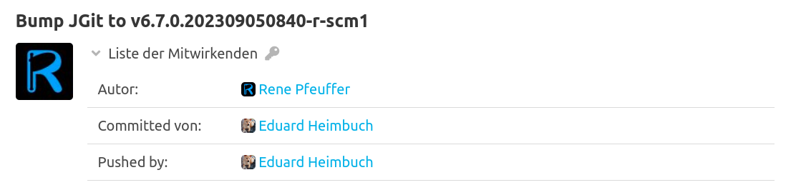
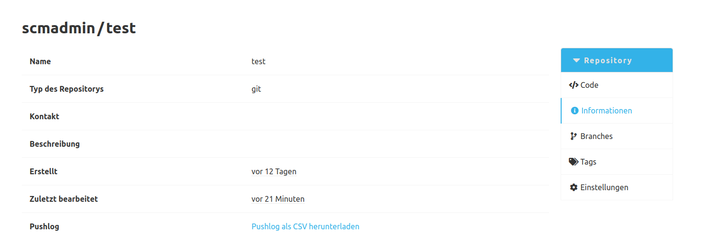

Das Pushlog Plugin protokolliert den `Pusher` jedes Commits auf den SCM-Server. 
Dabei wird diese Information nicht inhaltlich aus dem Commit ermittelt, sondern beim Eingang eines neuen Commits auf den Server wird der übertragende Benutzer gespeichert.

Diese Information findet sich dann in der Detail-Ansicht eines Commits als der `Mitwirkende` in der Kategorie `Pushed by`.

Zusätzlich ist es möglich alle Pushlog Einträge eines Repositories als CSV-Datei zu exportieren.
Dieses CSV enthält die ID des Pushlogs, die Commit Id, den Benutzernamen vom User der den Commit zu erst gepushed hat, den Zeitstempel wann der Commit beim Server eingegangen ist und die erste Zeile der Commit-Nachricht.
Der Downloadlink für den CSV-Export befindet sich in der Informationsseite eines Repositories.

