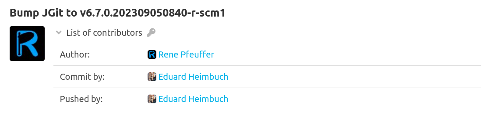

The pushlog plugin logs the `pusher` of each commit to the SCM-Server.
This information is not determined from the content of the commit, but the user who transfers the commit to the SCM-Server is stored as the pusher.

You can find the stored `pusher` in the detail view of a commit as the `contributor` in the `Pushed by` category.

