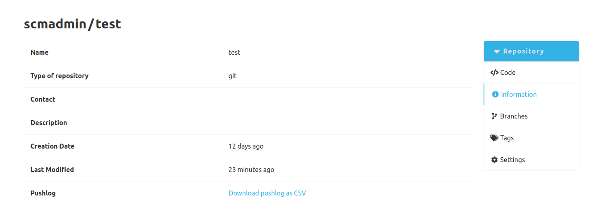

The pushlog plugin logs the `pusher` of each commit to the SCM-Server.
This information is not determined from the content of the commit, but the user who transfers the commit to the SCM-Server is stored as the pusher.

You can find the stored `pusher` in the detail view of a commit as the `contributor` in the `Pushed by` category.

It is also possible to export all push log entries of a repository as a CSV file.
This CSV contains the ID of the push log, the commit ID, the username of the user who first pushed the commit, the timestamp when the server received the commit and the first line of the commit message.
The download link for the CSV export can be found on the information page of a repository.

